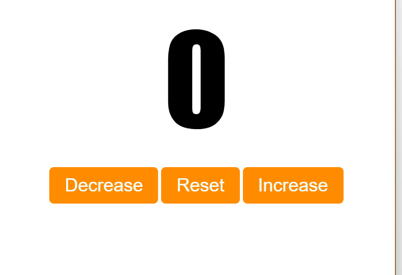
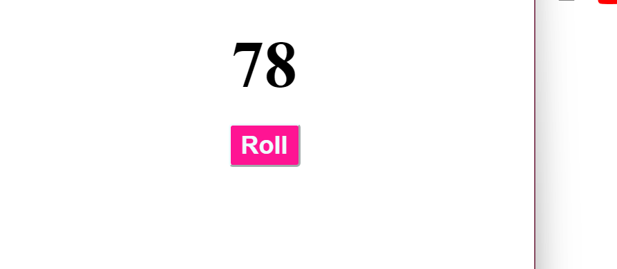
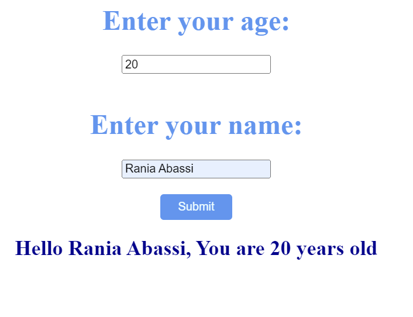

# **JavaScript Learning Repository**

Welcome to my JavaScript learning repository! 🚀 In this repository, you'll find a curated collection of resources, code snippets, and projects to help you grasp the fundamentals and advance your skills in JavaScript.

## Overview

JavaScript is a versatile programming language that powers the dynamic behavior of modern websites. Whether you're a beginner or looking to deepen your understanding, this repository aims to provide:

- **Code Snippets:** Explore practical code snippets covering various JavaScript concepts.
  
- **Projects:** Engage in hands-on projects to apply your knowledge and build real-world applications.

- **Resources:** Find useful links, tutorials, and documentation to enhance your learning journey.

## Table of Contents

1. [Code Snippets](#code-snippets)
2. [Projects](#projects)

## Code Snippets

Explore short and focused code snippets to understand specific JavaScript concepts.

```javascript
// Example Code Snippet
const greetUser = (name) => {
  console.log(`Hello, ${name}! Welcome to the JavaScript learning journey.`);
};

greetUser("Learner");

// Feel free to add more code snippets!
```

## Projects

<div align="center">
  
</div>
<div align="center">
  
</div>
<div align="center">
  
</div>

## Authors

- [@rania3103](https://www.github.com/rania3103)